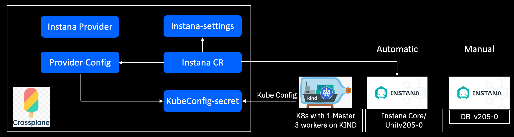

<!-- START doctoc generated TOC please keep comment here to allow auto update -->
<!-- DON'T EDIT THIS SECTION, INSTEAD RE-RUN doctoc TO UPDATE -->
**Table of Contents**  *generated with [DocToc](https://github.com/thlorenz/doctoc)*

- [Self-hosted Instana on kubernetes via crossplane](#self-hosted-instana-on-kubernetes-via-crossplane)
  - [Prerequisites](#prerequisites)
  - [Deploy instana on k8s via crossplane](#deploy-instana-on-k8s-via-crossplane)
    - [Create a secret storing target k8s kubeconfig](#create-a-secret-storing-target-k8s-kubeconfig)
    - [Create a configmap storing the instana settings](#create-a-configmap-storing-the-instana-settings)
    - [Create a provider config adding kubeconfig secret as target system credentials](#create-a-provider-config-adding-kubeconfig-secret-as-target-system-credentials)
    - [Create a instana CR to install instana on target k8s](#create-a-instana-cr-to-install-instana-on-target-k8s)

<!-- END doctoc generated TOC please keep comment here to allow auto update -->

# Self-hosted Instana on kubernetes via crossplane

`provider-instana` is a Crossplane Provider , which helps install self-hosted instana on k8s , the goal is to automate installing procedure .

## Prerequisites
- Crossplane server , https://crossplane.io
- K8S , In this example , we use [kind cluster](https://kind.sigs.k8s.io/) to host instances
- Instana DB , follow [instana database settup](https://www.instana.com/docs/self_hosted_instana_k8s/single_host_database/)
  


## Deploy instana on k8s via crossplane





### Create a secret storing target k8s kubeconfig

Using the kubeconfig in this repo as example :

```shell
kubectl create secret generic k8s-kubeconfig --from-file=credentials=./examples/provider/kubeconfig -n crossplane-system
```

### Create a configmap storing the instana settings 

```shell
kubectl create configmap instana-settings --from-file=./examples/instana/settings.hcl -n crossplane-system
```

### Create a provider config adding kubeconfig secret as target system credentials

```shell
cat << EOF | oc apply -f -
apiVersion: instana.crossplane.io/v1alpha1
kind: ProviderConfig
metadata:
  name: instana-provider-config 
spec:
  credentials:
    source: Secret
    secretRef:
      namespace: crossplane-system
      name: k8s-kubeconfig 
      key: credentials
EOF
```

Note: you need specify the corresponding secret name/namespace in [Create kubeconfig secret step](#create-a-secret-storing-target-k8s-kubeconfig)

### Create a instana CR to install instana on target k8s

```shell
cat << EOF | oc apply -f -
apiVersion: instana.crossplane.io/v1alpha1
kind: Instana
metadata:
  name: instana
spec:
  forProvider:
    instanaVersion: 205-2
    nfsServerHost: in-kind-instana-db.fyre.ibm.com
    settingsConfigmap:
      name: instana-settings
      namespace: crossplane-system
  providerConfigRef:
    name: instana-provider-config
EOF
```

Note: 
- `nfsServerHost`: we use NFS server to store spans (in [instana official doc](https://www.instana.com/docs/self_hosted_instana_k8s/installation/#settingshcl) , it use s3 as example ) , if you already config s3 in settings ,  you could just ignore this
- `settingsConfigmap` : let crossplane know where to find the settings , refer to [Create configmap steps](#create-a-configmap-storing-the-instana-settings)
- `providerConfigRef` : it will use providerconfig `instana-provider-config` , which point to target kubeconfig 
